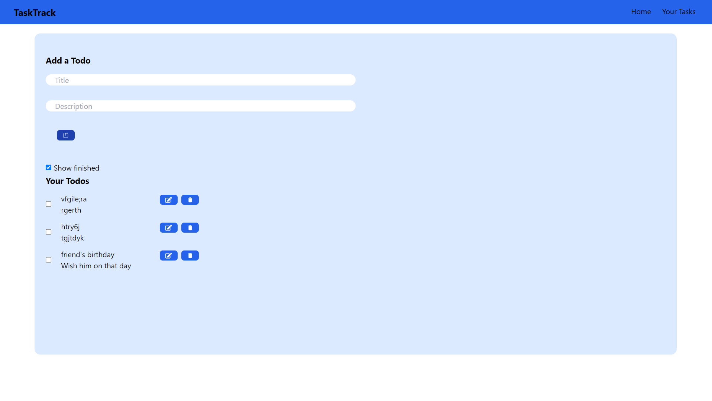
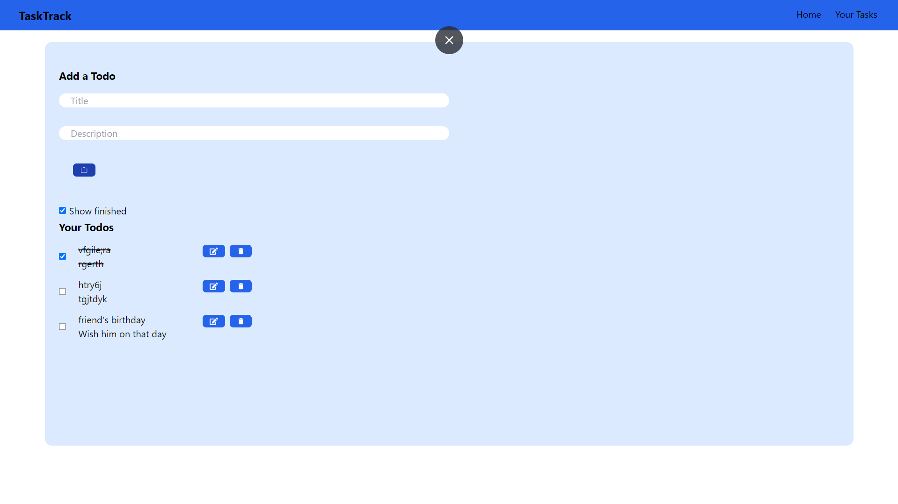

# Task Manager Website

## Overview
This project is a Task Manager website that allows users to manage their tasks efficiently. Users can add new tasks with titles and descriptions, edit existing tasks, delete tasks, and mark tasks as completed.

## Features
- **Add Task**: Add new tasks with a title and description.
- **Edit Task**: Modify the title or description of existing tasks.
- **Delete Task**: Remove tasks from the task list.
- **Mark Task as Completed**: Cross out tasks that have been completed.
- **Responsive Design**: User-friendly interface that works well on desktop and mobile devices.

## Technologies Used
- **Frontend**: Vite+React
- **Backend**: Node.js, Express.js

## Usage

